# Module 2: Handle customer requests to subscribe to services

In this module you will build on the Lex chatbot you started in module 1 and add abilities for it to subscribe users to additional services your company offers -- in this case, international plans you can add on to your existing phone plan for travel. 

You have already learned to define ***intents***, collect user inputs by leveraging ***slots*** in the last module. In this one we will go into more  advanced topics such as session management and input validation. 

<a name="session-context"></a>
## Maintaining conversation session context

Now the bot is capable of informing your customer the options they can add to the account, the next step is allow user to **choose a plan and add it to their account**. This serves an example for another common use case for chatbots: transactional requests such as updating account information, fulfill orders, etc. 

We can create a separate intent to apply the chosen plan into the user's account. This bring up the question of maintaining session context. During the same session, if the user asks to subscribe to a particular plan after hearing the list of options for a given country, the bot should maintain context and know which country is of interest when applying the plan. 

You can achieve this by using **Session Attributes**. Read [here](http://docs.aws.amazon.com/lex/latest/dg/context-mgmt.html) if you want more details of how session attributes work. You can set session attributes in the Lambda function that fulfills the bot logic. 


In the `ListInternationalPlans` intent we built in the last module, the lambda function is setting the `country` session attribute as part of the response, so subsequent conversation will have that context: 

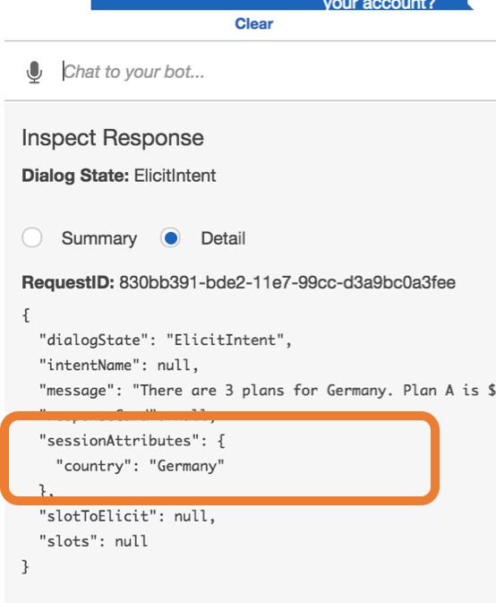

You can also take a look at the Lambda [source code](../lambda-functions/bot-handler/index.js) to see how it's setting the session attributes (look for the `listPlanIntent` function).

<a name="user-auth"></a>
## Identifying and authenticating the user

This type of transactional requests also require your bot to be able to identify and authenticate the user before fulfilling their request. 

The way you identify users can vary depend on where and how your Lex bot is deployed. 

If your Amazon Lex bot is deployed as a **Facebook Messenger** or **Slack** bot, the users are already logged in into Facebook/Slack respectively, and these channels will pass the user ID on these platforms into your bot. This means you need to build a backend that can correlate the Facebook/Slack user to your company's user management system. 

If your Lex bot is bulit as part of your **mobile/web app**, then you can rely on the normal authentication methods of your app for users to log in.

This workshop shows an example if your Lex bot is deployed with either **Amazon Connect** or **Twilio SMS**. In these two scenario, because the user is interacting with your bot through a phone, you can use the phone number as one of the factors in a Multi-factor Authentication flow. In this example, we will ask for a four-digit PIN for the account associated with the phone number. 

## Implementation Instructions

### 2A: Add intent to apply international plans to user's account

Let's start by defining the conversational interface of adding an international travel plan to the user's account. 

#### Conversational interface

1. Start by creating a new intent in the `InternationalPlan` bot you already created. Name it the `ApplyTravelPlan` intent

1. Create a slot `Country` for the country the travel plan applies to. 
	<details>
	<summary><strong> Expand for detailed instruction </strong></summary><p>

	* Name it `Country`
	* Use built-in type `AMAZON.Country`
	* For prompt, use `which country are you going to?`

	</details>


1. Create a new custom slot for plan name with 2 supported values: `basic` and `premium` and add it to the intent as slot `planName`.

	<details>
	<summary><strong> Expand for detailed instruction </strong></summary><p>
	
	1. On the left side bar, locate the **Slot Types** tab and click (+)

	1. Use `TravelPlan` for slot name

	1. 	For description, use something like `name of international phone plans`. 
	1. For **Slot Resolution**, because in this example our international phone plans only have two possible names, we will pick **Restrict to Slot values and Synonyms** (The "Expand Values" option is when the values are more open ended, e.g. book titles, company names, etc. ) 
	
	1. For acceptable values, put an entry for `basic` and another `premium`
	
		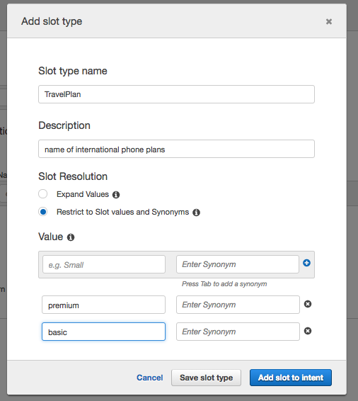

	1. Click **Add Slot to intent**
	
	1. Name the slot `planName` and use `which plan would you like to apply to your account?` for slot prompt

		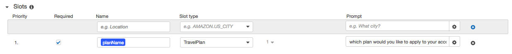

	</details>
	
1. Add additional slots to collect information on the plan start date (`startDate`) and duration (`numOfWeeks`)
	<details>
	<summary><strong> Expand for detailed instruction </strong></summary><p>
	
	1. For start date:
		* Name it `startDate`
		* Use built-in type `AMAZON.DATE`
		* For prompt, use 	`when do you like {planName} plan to start?`	
	1. For duration:
		* Name it `numOfWeeks`
		* Use built-in type `AMAZON.NUBMER`
		* For prompt, use `how many weeks will you need?`

	</details>

1. Ensure to check the **Required** checkbox for all the 4 slots

	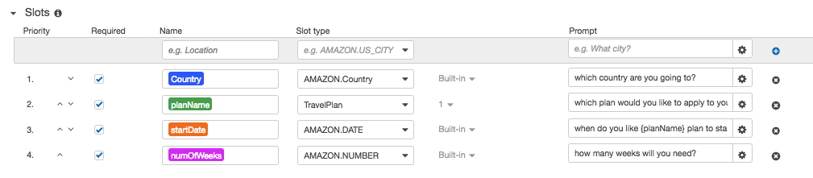

1. Add sample utterances:

	```
	​{planName}​
	​Yes. ​{planName}​ plan
	​apply ​{planName}​ plan to my account
	​apply ​{planName}​ plan
	​apply international plan to my account
	​apply travel plan to my account
	​I want to add travel plans to my account
	```

1. For a request that has impact on the customer's account, you can leverage the **Confirmation Prompt** feature to confirm choices users have made before fulfilling the intent. 

	<details>
	<summary><strong> Expand for detailed instruction </strong></summary><p>
	
	1. Expand the **Confirmation Prompt** section and click the **Confirmation prompt** check mark

	1. Fill in for **Confirm**
	
		```
		To confirm, you want to apply {planName} plan in {Country} for {numOfWeeks} weeks starting {startDate}, is that right?
		```
		
	1. For **Cancel (if the user says "no")**, fill in 
	
		```
		Ok. {planName} plan will not be added. How else can I help you?
		```
		
		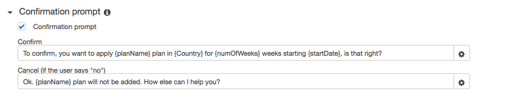
	</details>


1.  Build and test the conversation flow  

	<details>
	<summary><strong> Expand for detailed instruction </strong></summary><p>
	
	1. Click **Save Intent** to save the intent configuration
	
	1. Click **Build** at the top right of the page to build the bot 
	 
	1. Once the build complete, use the **Test Bot** window to test the conversation flow for this intent
	
		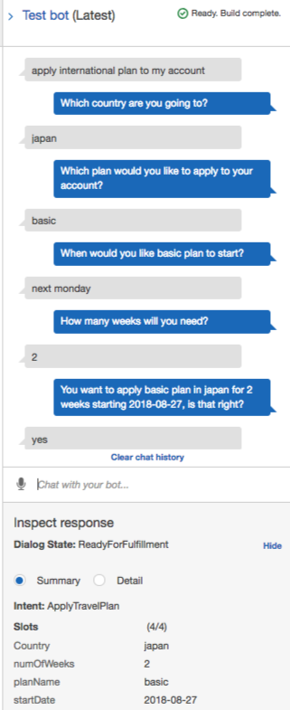
	</details>

#### Validate input with AWS Lambda

In the last module, we used AWS Lambda to fulfill user's intent. Another powerful integration is using Lambda functions to **validate user's inputs**. When you enable this feature, Lex invokes the specified Lambda function on each user input (utterance) after Amazon Lex understands the intent. 

Here are a few things this feature can help with our `ApplyTravelPlan` intent

* As soon as Lex recognize user's intent to subscribe to a plan, the Lambda function can check if the user has been authenticated (through [session attributes](#session-context)). If not, **force the user to verify their identity before proceeding**

* Validate the `startDate` user specified is later than today's date

* Validate the number of weeks user can apply their plan is between 0 and 52.  

* Validate there's a corresponding plan for user's specified country.    

Now, configure the `lex-workshop-LexBotHandler` function for input validation for this intent.

<details>
<summary><strong> Expand for detailed instruction </strong></summary><p>
	
1. Under **Lambda initialization and validation** setting for the intent, pick the `lex-workshop-LexBotHandler` lambda function
	
	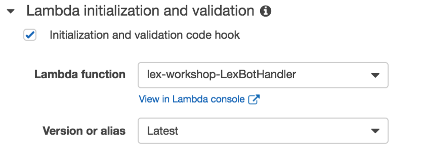
	
1. Click **Save Intent** to save the intent configuration
	
1. Build the bot and test it again. Note that the lambda validation is kicking in to force the user to verify their identity before proceeding:
	
	
		
</details>

### 2B: Add intent to verify user identity  

As discussed in the [Identifying and authenticating the user](#user-auth) section, if your user is interacting with your bot through a phone, the bot can look up their phone number and verify their identity by challenging them with one or more security questions. In this workshop we will use a four-digit PIN. 

To handle the identity verification flow, create a new intent with a slot for user pin. 

<details>
<summary><strong> Expand for detailed instruction </strong></summary><p>

1. Create a new intent `VerifyIdentity`

1. Create a `pin` slot with a built-in slot type `AMAZON.FOUR_DIGIT_NUMBER` with a prompt `What's your user pin?`

	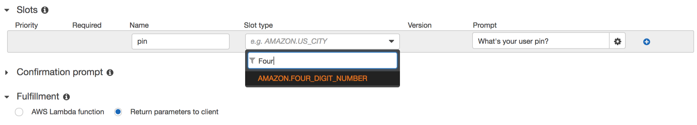

1. Make sure the **Required** checkbox is checked for the slot

	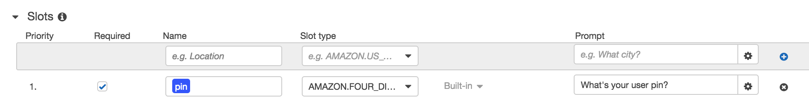


1. Add sample utterances for the intent:

	```
	{pin}
	my pin is {pin}
	verify my identity
	```

1. Configure `lex-workshop-LexBotHandler` lambda function for intent fulfillment: 

	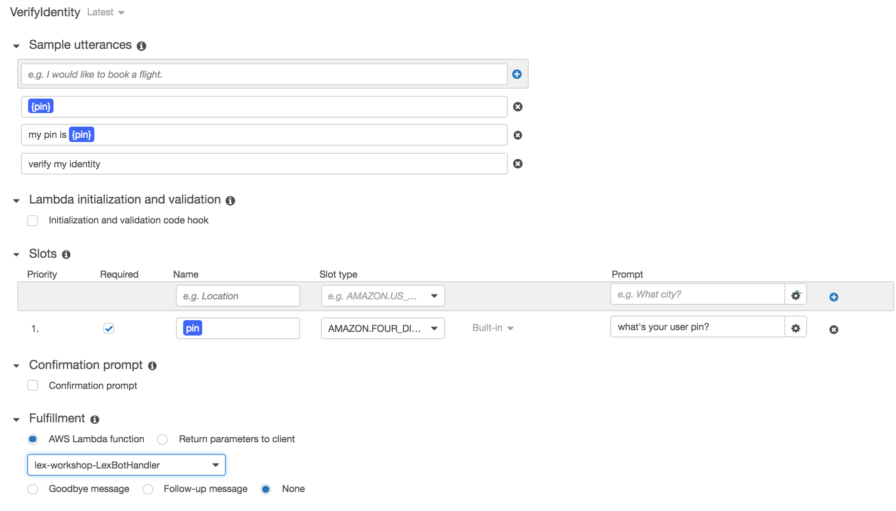

1. Save the intent 

1. Build the bot

</details>

> Note for testing the bot in Lex Console: 
> 
> When the lex bot is integrated with phone call (Amazon Connect) or SMS text (Twilio), the user pin verification logic in the lambda function uses the phone number of the user to look up the user and verify the corresponding pin.
> 
> In the bot testing window of the Lex Console, the userid is randomly generated by the Console and there's no "phone number" we can use to look up the user. To test the conversation flow during development, use the fake pin `1234`


### 2C: Configure fulfillment for adding international plans 

Now we are ready to fulfill user's request to add plans to their account! Configure the fulfillment for the `ApplyTravelPlan` intent to use the same lambda function `lex-workshop-LexBotHandler`


<details>
<summary><strong> Expand for detailed instruction </strong></summary><p>

1. Go to the `ApplyTravelPlan` intent

1. Under fulfillment, select `lex-workshop-LexBotHandler` lambda function

1. We can add a **follow-up message** for when the lambda function successfully add the plan to user's account: 
	* Follow-up message: `{planName} plan in {Country} has been added to your account. Can I help you with anything else?`
	* Cancel: `Ok. Thank you. Have a nice day.`

	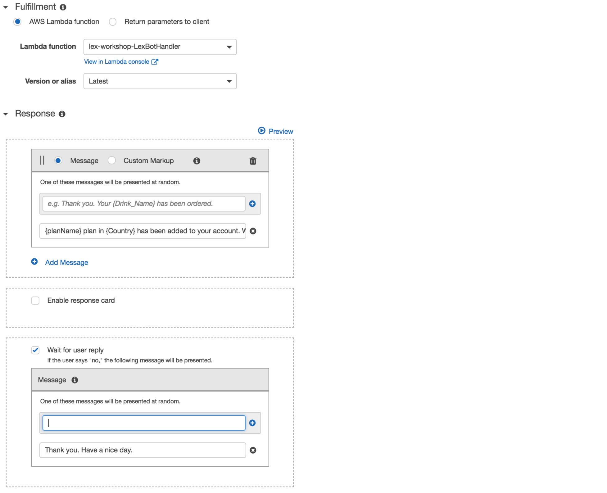

1. Save the intent 

1. Build the bot

</details>

   
### 2D: Test full flow

Now we have configured 3 intents:

* `ListInternationalPlans` - for users to inquire travel options they can add to phone plan
* `ApplyTravelPlan` - for applying a user's selected travel plan to their account
* `VerifyIdentity` - for verifying user's identity

We can now test how these intents can work together to provide a streamlined customer experience:

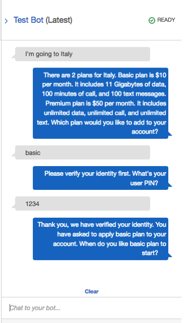

Note that by leveraging [session attributes](#session-context), the Lex bot is able to transition between different intents and "remember" what information user has already provided. In the above example, after user authentication, the bot is able to pick up where it left off and continue with fulfilling the intent to add the plan to user's account. 
<details>
<summary><strong> For detailed explanation on how this works, expand here</strong></summary><p>

If we take a look at the **Inspect Response** tab at this point, notice the below: 

* After verifying the user, the bot remembers the user was in progress to add a plan, and set the `intentName` to `ApplyTravelPlan` (see yellow highlight)
* After verifying the user, the bot sets the `sessionAttributes` to mark the logged in user (see red highlight)
* After verifying the user, the bot identifies inputs that user has provided in previous intents (e.g. `Country` and `planName`) and prompt the user to collect information that haven't been provided (see green highlight)


</details>


See below for an example of a full conversation flow:

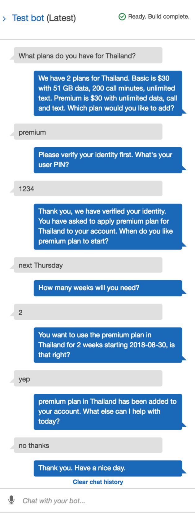

You can also verify the user's plan selections are being persisted in DynamoDB by checking the DynamoDB table. 

<details>
<summary><strong> Expand for detailed instruction </strong></summary><p>

1. Go to the [DynamoDB console](https://console.aws.amazon.com/dynamodb/home)

1. Select the table name starting with `lex-workshop-UserTravelPlansDDBTable`

	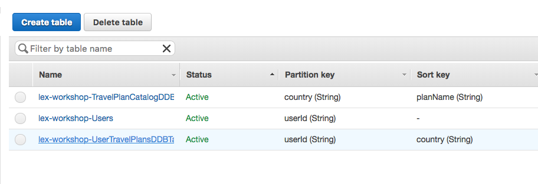

1. Verify you see the test user's applied plans and other attributes:

	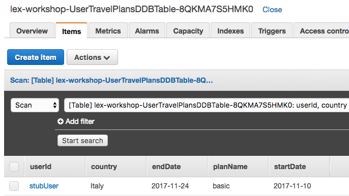

</details>

### 2E: Publish the bot 

An alias is a pointer to a specific version of an Amazon Lex bot. Use an alias to allow client applications to point to a tested version of the bot while you iterate on bot design (e.g. you might have different aliases for `prod`, `staging` and `dev` to represent different stages.)

Here we will publish the bot with alias `dev`.

<details>
<summary><strong> Expand for detailed instruction </strong></summary><p>

1. Click **Publish** button (upper right side on the console)

1. Use `dev` for alias

1. Click  **Publish** 

	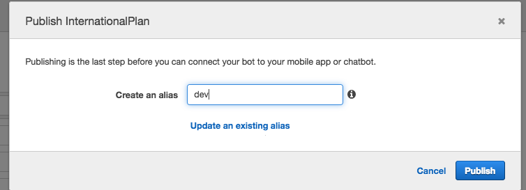


</details>

### Next step

Once you have a working Lex chatbot, you can choose to complete one or more of the following modules to integrate your Lex chatbot to different channels to interface with your customer:

* [Integrate Lex chatbot with Amazon Connect (voice over the phone)](../03_AmazonConnectIntegration)
* [Integrate Lex chatbot with Twilio SMS (text over SMS)](../04_TwilioSMSIntegration)

