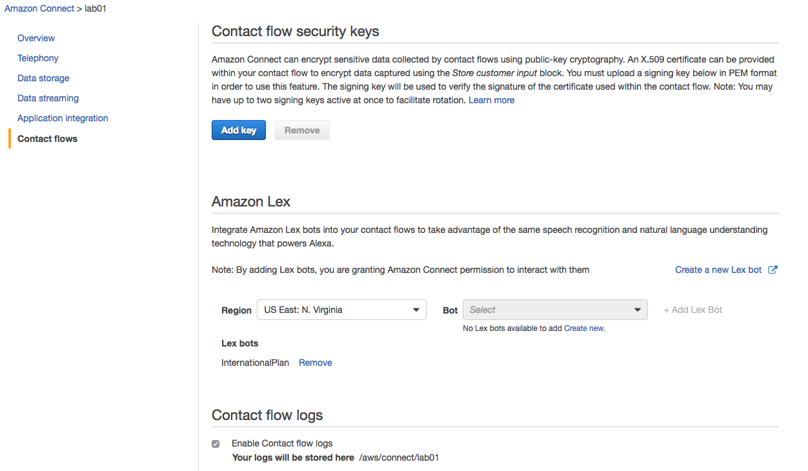
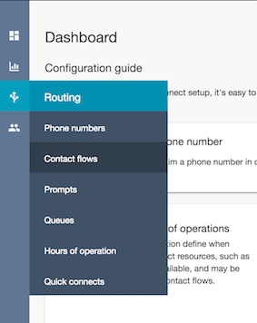
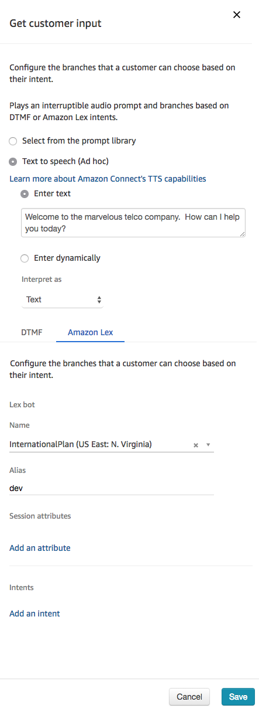
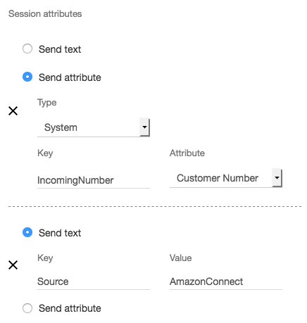
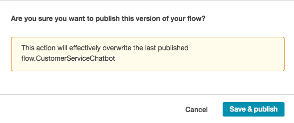

# Module 3: Integrate Amazon Lex with Amazon Connect
In this module you will integrate your Amazon Lex bot with Amazon Connect, a service that allows you to create software-defined call centers in minutes.

Upon completion, you will be able to interact with your bot using a telephone (yes, think PSTN).
To achieve this you will create a contact center, configure a simple call flow, and assign a phone number to the flow. 

## Implementation Instructions

Each of the following sections provide an implementation overview and detailed, step-by-step instructions. The overview should provide enough context for you to complete the implementation if you're already familiar with the AWS Management Console or if you want to explore the services yourself without following a walkthrough.

### Create a new Amazon Conect instance
Go to the [Amazon Connect Console](https://console.aws.amazon.com/connect/home?region=us-east-1) to create a new virtual contact center instance in the us-east-1 (Virgina) region.

<strong>Step-by-step instructions (expand for details)</strong>

1. From the AWS Management Console, choose **Services** then select **Amazon Connect** under Contact Center and then **Get started**

1. In **Step 1: Identity management**, select **Store users within Amazon Connect** and provide a domain name (e.g. `{FirstName}` to complete the **Access URL** and click **Next step**
	
	> The domain name used in your contact center URL needs to be globally unique and cannot be changed.
	Alternatively, Amazon Connect can use an existing [AWS Directory Services](https://aws.amazon.com/directoryservice) directory.   
		
1. In **Step 2: Administrator**, **Skip this** and continue with **Next step**

1. In **Step 3: Telephony options**, select **I want to handle incoming calls with Amazon Connect** and **I want to make outbound calls with Amazon Connect**

1. In **Step 4: Data storage**, accept the defaults

1. In **Step 5: Review and create**, review your settings and then select **Create Instance**

### Claim a phone number for your Amazon Connect instance
Once your Amazon Connect instance has been created, click **Get started** to select a phone number. 

<strong>Step-by-step instructions (expand for details)</strong>

1. Select **Get started** to open the Amazon Connect Contact Center Manager (CCM) welcome screen

1. Select **Let's go** to claim a phone number

1. Select **United States +1**, **Direct Dial**, and choose a phone number from the numbers provided

1. Dial the phone number you selected in step 3 from another phone (e.g. your mobile phone) and choose **1** from the voice menu to connect with an agent; you can then use the Amazon Connect Contact Control Panel to accept the call
	> It may take a few minutes before the claimed phone number is active.

1. Choose **Continue** to get to the Amazon Connect Contact Center Manager App (CCM); poke around a bit to see what's available
	> If you accepted a call, it should show up under the Contact search option.

### Configure contact flow
With a Connect instance and a phone number, you can now create the Contact Flow that allows callers to interact with our bot in [Module  1](../01_LexBotInformational).

<strong>Step-by-step instructions (expand for details)</strong>

1. In the Amazon Connect Console, select your instance, then choose Contact Flows to allow Amazon Connect to interact with the `InternationalPlan` bot

	

1. In the Amazon Connect Contact Center Manager, use the navigation pane on the left hand side to select **Routing** and then **Contact flows**

	
	
	> If you closed your browser window you can always re-open the Amazon Connect Contact Center Manager from the [Amazon Connect console](https://console.aws.amazon.com/connect/home?region=us-east-1). Just selct your Amazon connect instance and click on the **Login as administrator** button in the **Overview** section of the console. 

1. In the top right corner select **Create contact flow** to open the contact flow editor

1. Name your contact flow `CustomerServiceChatbot`

1. Expand the **Interact** group of blocks and drag and drop the **Get customer input** block onto the grid

1. Expand the **Terminate / Transfer** group of blocks and drag and drop the **Disconnect / Hang up** block onto the grid

1. Wire up the three building blocks as shown in the image below

	

1. Double click on the **Get customer input** block to access its configuration
	
	1. Select the **Text to speech (Ad hoc)** input type and use this welcome message:  ` Welcome to the marvelous telco company. How can I help you today?`
	
	1. Select **Amazon Lex** input type
	
	1. Enter `InternationalPlan` bot name and `dev` alias

	1. Click **Save**

		
	
1. Click on the **down arrow** () next to the Save button at the top right and select **Save & Publish**

1. Confirm publishing of the workflow in selcting the **Save & publish** button

### Associate contact flow with phone number
Now you need to associate your new contact flow with your phone number

<strong>Step-by-step instructions (expand for details)</strong>

1. Select **Routing** and **Phone Numbers** on the left hand Amazon Connect navigation pane.
2. Click on the number to edit the contact flow
3. Search and select the `CustomerServiceChatbot` contact flow in the **Contact flow/IVR** field.
4. Select **Save** to confirm the contact flow association.

### Enable Amazon Lex integration for your contact flow 
As a final step we need to enable the Amazon Lex integration point for our Amazon Connect instance in the Amazon Connect console.

<strong>Step-by-step instructions (expand for details)</strong>

1. Open the [Amazon Connect console](https://console.aws.amazon.com/connect/home?region=us-east-1) and select your Amazon Connect instance.
2. Select **Contact flows** on the left hand navigation.
3. In the **Amazon Lex** section select **+ Add Lex Bot**, select the `InternationalPlan` bot and click on **Save Lex Bots**.

### Test your Amazon Lex enabled Amazon Connect contact flow
Dial your Amazon Connect contact center phone number to confirm functionality of contact flow and Amazon Lex integration. Tell the virtual service agent **"I am going to China."**, use 1234 when asked for your pin code.

### Extend contact flow integration to submit dialer ID to Amazon Lex 
In this last step we are enhancing the customer input configuration of the contact flow to submit the dialer ID to Amazon Lex for authentication.

 

<strong>Step-by-step instructions (expand for details)</strong>

1. Re-open the Amazon Connect Dashboard. Within the [Amazon Connect console](https://console.aws.amazon.com/connect/home?region=us-east-1) select **Overview** and **Login as administrator**
2. On the left hand navigation select **Routing** **Contact flows**.

	
	
3. Click on the 'CustomerServiceChatbot' flow to open the flow.

4. Double click on the **Get customer input** block to access its configuration.
5. Scroll to the bottom and under **Session attributes** click **Add a parameter**
6. Select **Send attribute**
7. In the **Type** drop-down, select **System**, Enter  `IncomingNumber` in the **Key** field and select **Customer Number** from the **Attribute** drop down.
8. Click **Add another Parameter**
9. Enter `Source` as **Key** and `AmazonConnect` as **Value**
10. Select **Save**
11. Click on the **down arrow** () next to the save button and select **Save & Publish**
	
12. Confirm publishing of the workflow in selecting the **Save & publish** button.
 	

	
	
### Test your bot with Amazon Connect
Call your Amazon Connect phone number to interact with your bot over the phone.  Ask the virtual service agent **"What iternational plans do you have?"**. When asked for your pin code enter the last four digits of the phone number you are calling from.	
	

