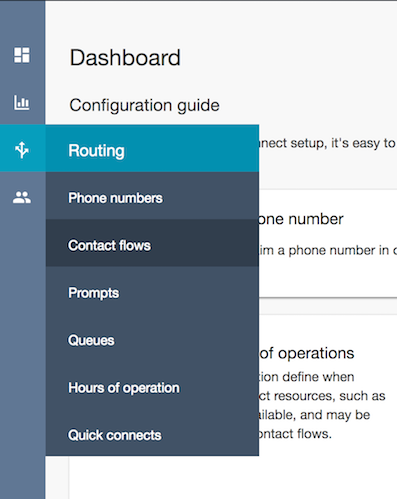
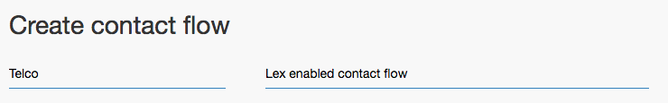
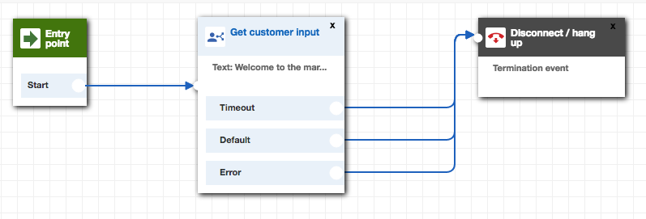
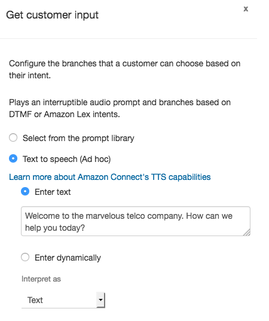
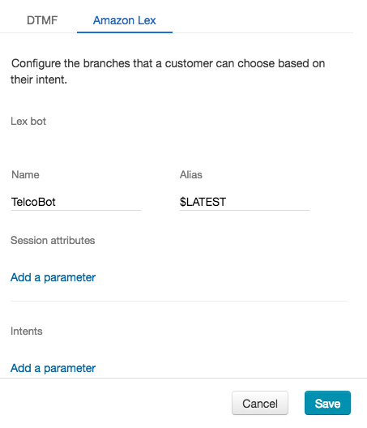

# Module 3: Integrate Amazon Lex with Amazon Connect
In this module you will integrate your Lex bot with Amazon Connect, a contact center service that makes it easy for any business to deliver better customer service at lower cost.

At completion of this module your customers will be able to interact with your Lex bot through the plain old telephone service.
To achieve this you will create a contact center, configure a simple call flow, and assign a public phone number to the flow. 

## Implementation Instructions

Each of the following sections provide an implementation overview and detailed, step-by-step instructions. The overview should provide enough context for you to complete the implementation if you're already familiar with the AWS Management Console or you want to explore the services yourself without following a walkthrough.

### Create a new Amazon Conect contact centre instance
An Amazon Connect instance is the starting point for your contact center.

Use the Amazon Connect console to create a new virtual contact center instance in the us-east-1 (Virgina) region.

<strong>Step-by-step instructions (expand for details)</strong>

1. From the AWS Management Console, choose **Services** then select **Amazon Connect** under Contact Center.
2. Choose **Add an instance**.
3. For the Identity management step, choose **Store users within Amazon Connect** and type a domain name to complete **Access URL**. This domain is used in your contact center URL and cannot be changed. Choose **Next step**.
4. For the Administrator step, you can **skip** this step for now and add an administrator later on.
5. For the Telephony options step, select **Incoming and Outbound calls**.
6. For the Data storage step, **keep the default** settings and choose **Next step**.
7. For the Review and Create step, review your settings and then choose **Create Instance**. 

### Claim a phone number for your Amazon Connect instance
After your Amazon Connect instance is created, choose **Get started** to select a phone number. 

<strong>Step-by-step instructions (expand for details)</strong>

1. Choose **Get started** to open the Amazon Connect Welcome screen.
2. Select **Let's go** to claim a phone number.
3. Select **United States +1**, **Direct Dial**, and choose a phone number from the numbers provided. Select **Next**
4. Dial the phone number you selected in step 3 from another phone (e.g. your mobile phone) and choose the menu item to connect with an agent. You can then use the Amazon Connect Contact Control Panel located to the side to accept the call.
5. Select **Continue**. This will open the Amazon Connect console.

### Configure contact flow
With your contact centre instance set-up and a phone number claimed, you can now create the call flow that integrates with Amazon Lex.
Before you continue, ensure that you have followed the instructions to configure your Amazon Lex bot **TODO: ADJUST NAME AND ADD LINK AS APPROPRIATE**

<strong>Step-by-step instructions (expand for details)</strong>

1. In the Amazon Connect Dashboard, use the navigation pane on the left hand side to select **Routing** and **Contact flows**.

2. In the top right corner select **Create contact flow** to open the contact flow editor.
3. Provide a name and a description for your new contact flow 

4. Expand the **Interact** group of blocks and drag and drop the **Get customer input** block onto the grid.
5. Expand the **Terminate/Transfer** group of blocks and drag and drop the **Disconnect** block onto the grid.
6. Wire up the three building blocks as shown in the image below.

7. Double click on the **Get customer input** block to change its configuration. 
	1. Select **Text to speech (Ad hoc)** and enter a welcome message for your callers as shown in the example below.
	2. Select **Amazon Lex** input type
	3. Enter bot name as defined in instructions to set-up Amazon Lex Bot **TODO: ADJUST NAME AND ADD LINK AS APPROPRIATE**
	4. Set Alias to **$LATEST**
	5. Click **Save**
	
	
	
	
	
8. Click on the **down arrow** () next to the save button and select **Save & Publish**
9. Confirm publishing of the workflow in selcting the **Save & publish** button.

### Associate contact flow with phone number
Now you need to associate your new contact flow with your phone number

<strong>Step-by-step instructions (expand for details)</strong>

1. Select **Routing** and **Phone Numbers** on the left hand Amazon Connect navigation pane.
2. Click on the number to edit the contact flow
3. Search and select your contact flow in the **Contact flow/IVR** field.
4. Select **Save** to confirm the contact flow association.

### Enable Amazon Lex integration for your contact flow 
While we have been able to configure the integration with Amazon Lex we still need to enable the Amazon Lex integration point for our Amazon Connect instance in the Amazon Connect console.

<strong>Step-by-step instructions (expand for details)</strong>

1. Open the [Amazon Connect console](https://console.aws.amazon.com/connect/home?region=us-east-1) and select your Amazon Connect instance.
2. Select **Contact flows** on the left hand navigation.
3. In the **Amazon Lex** section select **+ Add Lex Bot**, select your bot name and select **Save Lex Bots**.

### Test your Amazon Lex enabled Amazon Connect contact flow
Dial your phone number to confirm functionality of contact flow and Amazon Lex integration.

