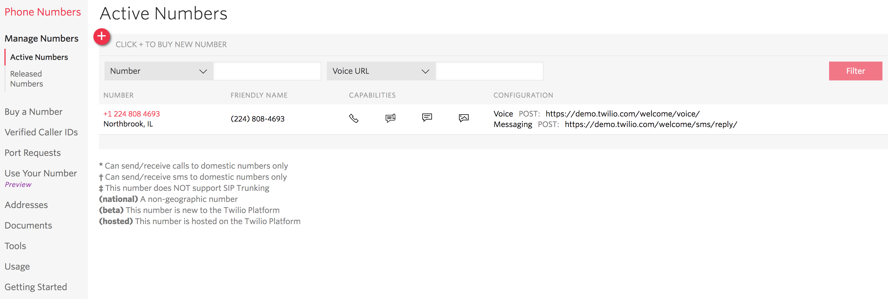
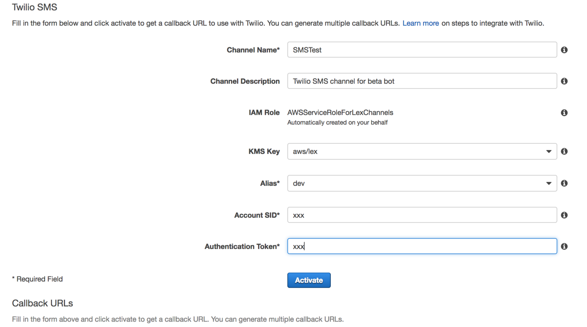
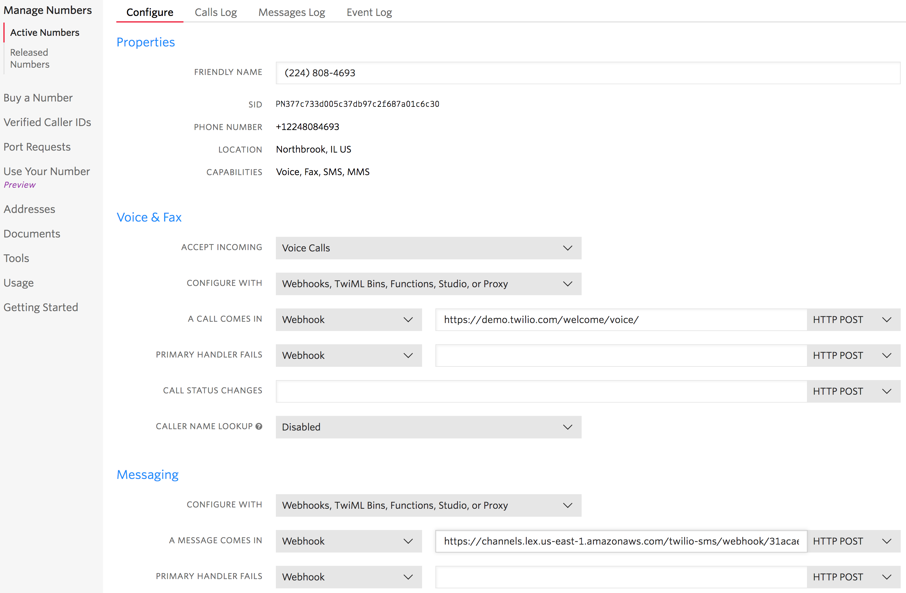

# Module 4: Integrate Amazon Lex with Twilio Programmable SMS 

Amazon Lex offers built-in integration with Facebook, Slack and Twilio. In this module you will integrate your Lex bot with Twilio Programmable SMS platform. With this integraton you will be able to interact with your Lex bot through an SMS service. To achieve this you will have to create a Twilio trial account and set up a Twilio SMS-enabled phone number where users can send SMS messages to interact with your bot. 

## Implementation Instructions

Each of the following sections provide an implementation overview and detailed, step-by-step instructions. The overview should provide enough context for you to complete the implementation if you're already familiar with the AWS Management Console and Twilio or you want to explore the services yourself without following a walkthrough.

### Signup for a new Twilio trial account
If you don't already have an account, sign up [here](https://www.twilio.com/try-twilio).

Next, set up a Twilio SMS-enabled phone number where users can send SMS messages to interact with your bot. If you don’t already have a Twilio account, you can sign-up for a trial account, which includes a free phone number. Make sure that your Twilio number has SMS capability turned on, and that you verify your own phone number with Twilio for testing. Remember, Twilio trial account has some limitations for example for the phone number you choose you will be able to interact with verified phone numbers only. Which means in order to test you bot with Twilio integration you have to verify your phone number by adding to Verified Caller ID's in the Twilio console.

On the Twilio Console Dashboard, note your Twilio Account SID and your Auth Token (Test first, Live when you're ready). will need this information later.

<strong>Step-by-step instructions (expand for details)</strong>

1. Once you sign up for the trial account, take a note of the Twilio Account SID and the Twilio Auth Token under Dashboard - Settings - General settings (note:  you may have to create a `Learn & Explore` project to get started).

1. Under Phone Numbers, pick a phone number.  This phone number will be the SMS phone number which your bot users will use to interact with the Lex bot you created.  Please choose a US number because Twilio supports SMS for US numbers only at this time.

    

1. Under Verified Caller IDs section, verify the phone number you will use for testing. (For example, this is your mobile number if you intend to use that device to test your bot over SMS.)

### Integrate the Twilio Messaging Service Endpoint with the Amazon Lex Bot 
To associate the Amazon Lex bot with your Twilio programmable SMS endpoint, create a channel association in the Amazon Lex console. When the channel association has been activated, Amazon Lex returns a callback URL. Record this callback URL for later.

<strong>Step-by-step instructions (expand for details)</strong>

1. Open the [Amazon Lex console](https://console.aws.amazon.com/lex/home?region=us-east-1) and choose the `InternationalPlan` bot

1. Choose the **Channels** tab; then **Twilio SMS**

1. Provide the following information:
	* Channel name: `SMSTest`
	* Channel description: `Twilio SMS channel for dev bot`
	* KMS key:  `aws/lex`
	* Alias:  `devt`
	* Use the Auth Token and Account SID from earlier
	* Activate; note the endpoint created for Twilio SMS

    

1. Next, we need to connect the Twilio SMS endpoint to the Amazon Lex bot using the Twilio Console

1. From Manage Numbers - Active Numbers, select the number to configure the Messaging webhook with the callback URL provided by Amazon Lex above

    

### Test your Amazon Lex bot using Twilio SMS

Now re-test the Amazon Lex integration with Twilio Integrationn enabled. Send anSMS to your Twilio SMS number to confirm functionality. Please note for Twilio trial accounts you need to verify caller ID. Go to home dashboard, then to the manage phone number screen, here in the verify callerID section, activate your phone number with which you intend to send out an SMS to the Twilio phone number. Once you have done that test out the twilio integration by sending a text to the bot. When asked for your pin code enter the last four digits of the mobile number you are calling from.

