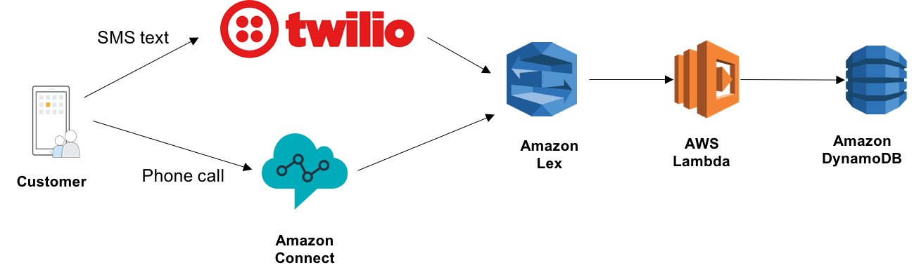

# Build a customer service chatbot with Amazon Lex

Amazon Lex allows you to quickly and easily build sophisticated, natural language, customer service chatbots. 

In this workshop, you will build a customer service chatbot for a fictitious telco company. They want to make it really easy for their customers to add an international plan to their existing phone account when their customers travel abroad for business and vacation. 

The application architecture uses [Amazon Lex](https://aws.amazon.com/lex/), [AWS Lambda](https://aws.amazon.com/lambda/) and [Amazon DynamoDB](https://aws.amazon.com/dynamodb/). You will build an Amazon Lex chatbot that understands customers' speech or text inputs. Data about available plans and user's chosen plans are persisted in DynamoDB. AWS lambda functions get triggered by Amazon Lex to execute business logic and interact with the DB layer. You can then connect the Lex chatbot with twilio SMS, which allows users to access your bot over SMS text messages; or Amazon Connect, which allows users to call your customer service number and interact with AI through voice.  

See the diagram below for a depiction of the complete architecture.

## Prerequisites

### AWS Account

In order to complete this workshop you'll need an AWS Account with sufficient permission to create AWS IAM, Amazon Lex, Amazon Connect, Lambda, DynamoDB and CloudFormation resources. The code and instructions in this workshop assume only one student is using a given AWS account at a time. If you try sharing an account with another student, you'll run into naming conflicts for certain resources. You can work around these by appending a unique suffix to the resources that fail to create due to conflicts, but the instructions do not provide details on the changes required to make this work.

## Modules

This workshop is broken up into multiple modules. For building out your Lex chatbot, you must complete the following module in order before proceeding to the next:

1. [Build a Lex chatbot and handle informational queries](01_LexBotInformational)
1. [Handle customer requests to subscribe to services](02_LexBotSubscribeService)

Once you have a working Lex chatbot, you can choose to complete one or more of the following modules to integrate your Lex chatbot to different channels to interface with your customer:

* [Integrate Lex chatbot with Amazon Connect (voice over the phone)](03_AmazonConnectIntegration)
* [Integrate Lex chatbot with Twilio SMS (text over SMS)](04_TwilioSMSIntegration)

Extra credit ideas:

* [Extra credit](10_ExtraCredit)

Resource cleanup:

* [Resource clean-up](11_Cleanup)

